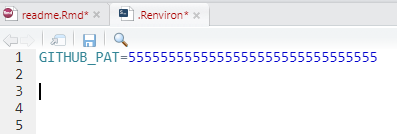
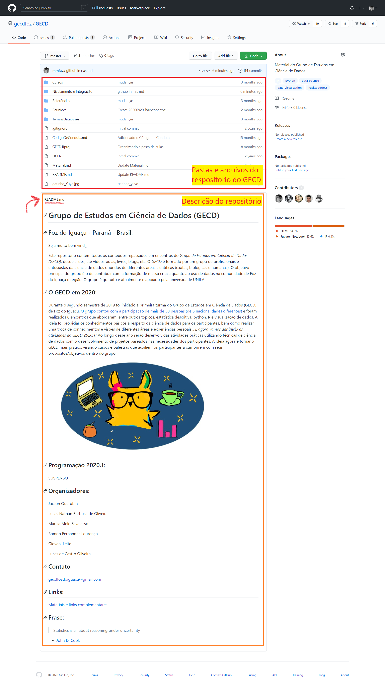
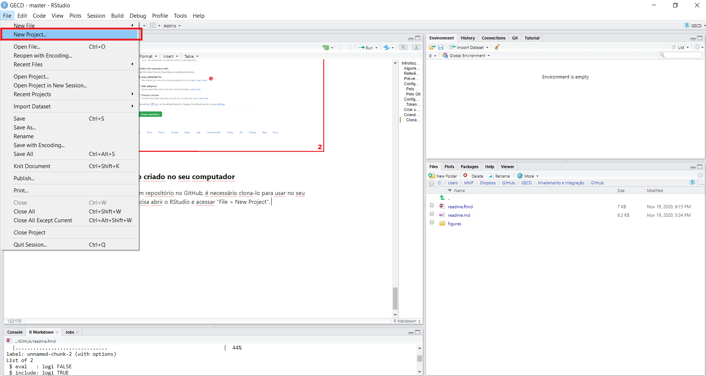
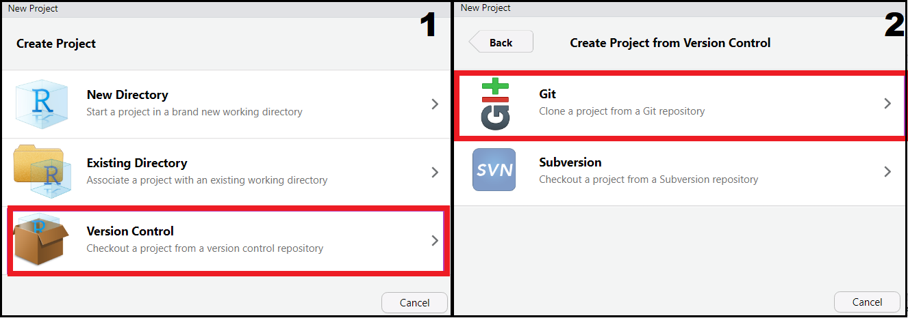
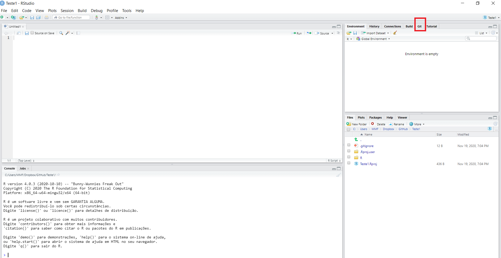
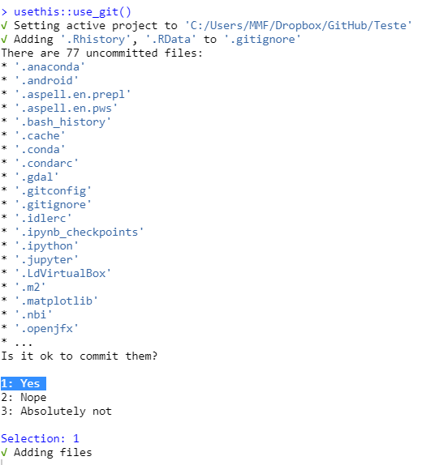

Introdução ao Git e ao GitHub
=============================

O *Git* é um software de controle de versões que tem como objetivo
gerenciar arquivos texto, principalmente códigos de programação. O
funcionamento dessa ferramenta é semelhante aos sistemas de nuvens
(Google Drive, Dropbox, Mega, etc), em que podemos compartilhar as
edições de um script com uma equipe, além de retomar antigas versões de
nossos arquivos. Resumidamente, o *Git* examina as mudanças realizadas
nos arquivos de um diretório e vai guardando essas informações para
compartilhar com outros usuários e/ou possibilitar a reversão de
alterações realizadas. Além de ser uma ferramenta extremamente útil, o
*Git* se conecta ao serviço de hospedagem e armazenamento de versões
chamado *GitHub*. A partir do *GitHub* é possível contribuir com
projetos de qualquer lugar do mundo, além de compartilhar os nossos
próprios códigos com fins de divulgação e/ou colaboração.

A partir do *RStudio* temos algumas maneiras bem práticas de trabalhar
com o *Git* e o *GitHub*, o que poderá mudar a sua vida diária nos seus
trabalhos com o *R*!

Alguns exemplos
---------------

Para iniciar a familiarização com a ferramenta, que tal conhecer alguns
projetos hospedados no GitHub?

1.  Temos o repositório do nosso grupo de estudos, o
    [GECD](https://github.com/gecdfoz/GECD).
2.  O projeto
    [Fio-de-Ariadne](https://github.com/cuducos/fio-de-ariadne).
3.  (…)

Referências desse curso
-----------------------

“Nessa vida nada se cria, tudo se transforma”. Dito isso, deixo na
sequência as referências que usei para criar esse tutorial. Recomendo a
leitura de cada uma!

-   Curso-R. [Rstudio e GitHub no
    dia-a-dia](https://www.curso-r.com/blog/2017-07-17-rstudio-e-github/).

-   Beatriz Milz. [Primeiros passos utilizando o Git e o GitHub no
    RStudio](https://beatrizmilz.github.io/RLadies-Git-RStudio-2019/#1).

-   TreinaWeb. [Github: Pare com as senhas e utilize Tokens de
    Acesso](https://www.treinaweb.com.br/blog/github-pare-com-as-senhas-e-utilize-tokens-de-acesso/).

Pré-requisitos
--------------

-   Instalar o
    [R](https://cran.r-project.org/bin/windows/base/R-4.0.3-win.exe) e o
    [RStudio](https://rstudio.com/products/rstudio/download/) (lembre de
    sempre manter versões atualizadas!).

-   Fazer uma conta no [GitHub](https://github.com/). Se você é
    estudande, pode usar o seu e-mail institucional para obter alguns
    com o [GitHub Student Developer
    Pack](https://education.github.com/pack).

-   Instalar o [Git](https://git-scm.com/download/).

-   Instalar o pacote “[usethis](https://usethis.r-lib.org/)”

<!-- -->

    install.packages("usethis")

Configurando o Git
------------------

Após instalar todas as aplicações necessárias, nós vamos configurar o
Git em nossas máquinas. Esse passo será feito uma única vez!

### Pelo RStudio

No RStudio você precisa escrever e executar a seguinte função com o nome
e e-mail cadastrado em sua conta GitHub:

    usethis::use_git_config(user.name = "Marília Melo Favalesso", # Seu nome
                            user.email = "mariliabioufpr@gmail.com ") # Seu email

### Pelo Git

Outra possibilidade é executar essa configuração diretamente no Git em
sua máquina:

Configurando o GitHub
---------------------

### Token de acesso pessoal (PAT)

Um token de acesso pessoal é uma alternativa à senha que você usaria ao
acessar sua conta no serviço de hospedagem do repositório GitHub. De
forma simplificada, seria uma chave com um formato semelhante a
`48t979e5677b198592e5047da8a79f53bcasb4b10` que dará permissão ao
RStudio acessar diretamente o seu GitHub.

A sua senha dá acesso a tudo em sua conta. Quem tiver sua senha pode
apagar seus repositórios, alterar seus dados, fazer commits para
qualquer repositório privado onde você possui permissões, apagar sua
conta, etc. Concorda que se sua senha vazar ou se alguém tiver acesso a
uma máquina onde sua senha está salva, esta pessoa terá muito poder?

Já os Tokens de Acesso te dão mais controle. Você pode criar vários e
configurar as permissões que cada um vai ter. Se por algum motivo ele
vazar, a sua conta continua salva. Se alguém tiver acesso a uma máquina
onde seu token está salvo, a pessoa estará limitada a fazer apenas as
ações que você liberou para aquele token. E com apenas um clique você
pode apagar o token que quiser.

O Token de Acesso é algo simples que pode melhorar na sua segurança.
Além disso, já faz um tempo que o Github vem avisando que logo
desabilitará a autenticação por senha ao utilizar a linha de comando ou
a API.

Para criar o token de acesso, vamos executar o comando que aparece na
sequência.

    usethis::browse_github_token()

Ao executa-lo, uma página do GitHub irá abrir. Nela você poderá dar um
novo para o novo token, como “Grupo de Estudos”, “Projeto do R-Ladies”,
etc. No restante da página você poderá selecionar as permissões que quer
dar para esse token. Para selecionar seus repositórios pela linha de
comando, selecione o `repo`.

No final da página, ao clicar em `Generate token`, seu token será gerado
e exibido para você. Copie **agora** e guarde esse número. Por motivos
de segurança, assim que sair dessa página, você nunca mais verá esse
token novamente. Se perder, basta criar outro.

Agora, quando for usar a linha de comando para fazer operações de Git ou
quando for criar uma aplicação que usa a API do Github, basta usar esse
token no lugar da sua senha. Para agilizar, já vamos incluir o token nas
configurações do nosso ambiente R e deixar tudo certo para o uso.

Primeiro precisamos abrir o arquivo `.Renviron`:

    usethis::edit_r_environ()

O RStudio abrirá o arquivo como uma nova página e nele vamos precisar
escrever um comando ‘github\_pat’ seguido pelo número do token gerado,
ou seja, `GITHUB_PAT=NUMERO_DO_TOKEN`.

Após escreve-lo, pule uma linha e salve o arquivo. Na sequência,
reinicie o RStudio com CTRL + SHIFT + F10.

Criar um repositório no GitHub
------------------------------

Um repositório é um local (pasta/diretório) dentro de sua conta do
GitHub que é feita para gerenciar um projeto. O repositório pode conter
pastas, arquivos, imagens etc; enfim, tudo que o seu projeto precisar.

O GitHub sempre aconselha seus usuários a incluírem um arquivo
“*README.md*” contendo todas as informações sobre o seu projeto nos
repositórios criados. Esse arquivo precisa estar no formato ‘md’ e
escrito em linguagem ‘markdown’.

Criando um repositório diretamente no GitHub
--------------------------------------------

Acesse a sua conta GitHub e acesse a opção “new” na guia “repositories”
(1a). Na página que aparecerá na sequência, incluir um nome para o seu
repositório (2b), uma descrição (2c), determinar se o seu repositório
será público ou privado (2d) e peça para o GitHub adicionar um arquivo
para a descrição do seu repositório (README.md) (2e).

### 

#### Dicas:

Coloque um nome sem espaço e sem caracteres especiais no seu
repositório. Quanto mais simples o nome, melhor! Por exemplo, em ver de
colocar o nome “Meu respositório”, colocar “meu\_repositorio”.

A descrição desse repositório deve ser direta e sucinta! As informações
mais detalhadas estarão no arquivo ‘README.md’.

### Clonar o repositório criado no seu computador

Agora que você já criou um repositório no GitHub, é necessário clona-lo
para usar no seu RStudio. Para tal, você precisa abrir o RStudio e
acessar “File &gt; New Project”.

Na aba “Create Project” (1), selecionar a opção **Version Control** e,
na sequência, em “Create Project from Version Control” (2) eleger a
opção **Git**.

  

Em seguida, na guia “Clone Git Repository”, você precisara preencher os
dados do repositório que você quer clonar. Especificamente, você
precisará copiar a URL do seu repositório GitHub (1b) na guia
“Repository URL” (2a). Após inserir a URL, o campo “project directory
name” (2b) será preenchido automaticamente. Para finalizar, você precisa
escolher um diretório - uma pasta no seu computador - para manter uma
cópia local do seu repositório (2c).

O *RStudio* irá fazer o clone do repositório, e abrirá um RProj para ele
(caso não exista um ainda, será criado).

Criando um repositório pelo RStudio
-----------------------------------

Você também pode criar um novo repositório pelo RStudio utilizando a
função `create_package("diretorio/nome_repo")`. Com ela, você precisará
fornecer um diretório e o nome do novo¹ repositório. **!!Importante não
repetir nome de repositório!! Os nomes precisam ser únicos**.

Relativo ao diretório, eu tenho um padrão em meu computador chamado
“GitHub” onde salvo todos os repositórios que eu trabalho.

    usethis::create_project("C:/Users/MMF/Dropbox/GitHub/Teste1")

O *RStudio* abrirá outra janela, com o novo projeto criado.

### Guia Git no RStudio

Agora que você já sabe como criar e clonar repositórios, as próximas
estapas serão aprender a salvar as mudanças realizadas (*commit*) e
envia-las para o seu repositório no Github (*push*). Para facilitar a
nossa vida, vamos precisar que o RStudio abra uma guia chamada “Git”.
Caso o seu *RStudio* já apresente essa guia, pode pular para a próxima
etapa! Caso não, continue nesse tópico.

Aqui vamos trabalhar na janela que o RStudio abriu com o nosso novo
projeto criado.

Primeiro vamos executar o comando `use_git()`do pacote usethis. Ao
realizar a ação, o programa irá perguntar

    usethis::use_git()

  
  
